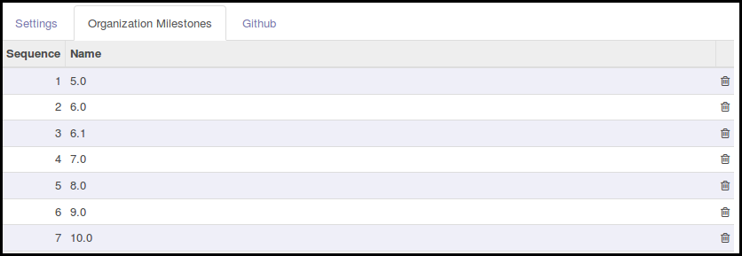
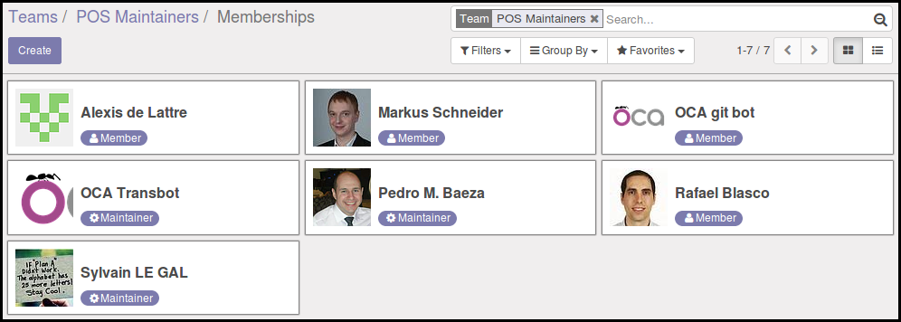
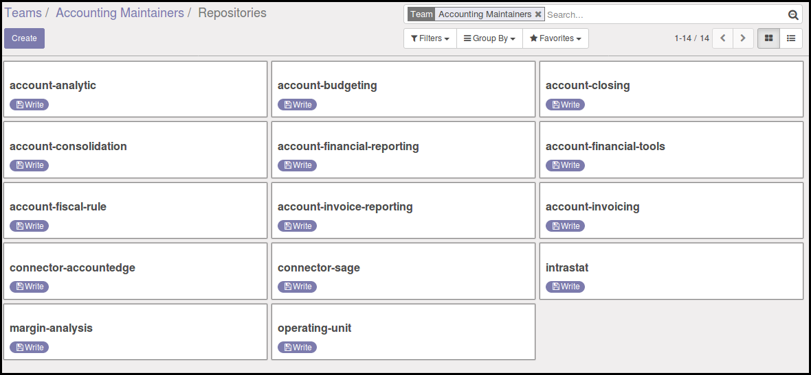
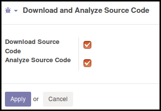
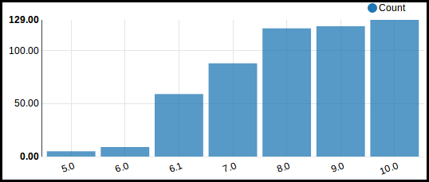
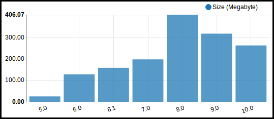
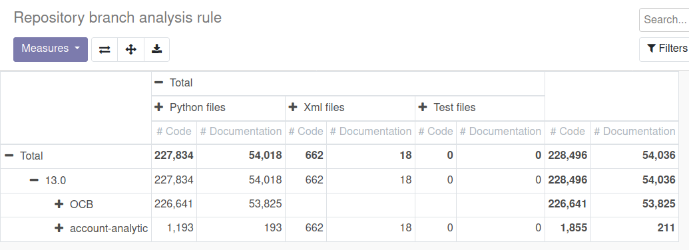

## Initial upload from Github

To fetch information from Github, you have to:

1.  go to 'Github' / 'Settings' / 'Sync Object'

2.  Select the object type you want to synchronize and its Gthub name

    

3.  Once done for your organization(s), go to 'Github' / 'Github
    Commnunity' / 'Organizations'

    

4.  Optionally, once organization is created, you can create series for
    your projects. Go to 'Github' / 'Organizations' / click on your
    organization / 'Organization Series' Tabs

    

## Select branches to download

This setting will prevent to download undesired branches, downloading
only main branches (releases):

1.  In the 'Settings' tab, set repositories you don't want to download
    (or repositories you want to download). If 'Specific repositories'
    is set, 'Ignored Repositories' value is ignored.

2.  In the 'Settings' tab, set the URL of the 'External Services' you
    use for Continuous Integration and Coverage.

    

3.  Once done, click on buttons 'Syncs', to synchronize repositories,
    teams and members. (This process can take a while depending of your
    size)

    

## Team / members synchronization

You can synchronize members teams:

1.  Go to 'Teams' / tree view / 'Actions' / 'Update from Github'.

    

2.  In each team, you can see the members list and the role of the
    members

    

3.  In each team, you can see the repositories list but not the
    permissions of the team. (See 'Known Issues' Section)

    

## Repositories synchronization

You can synchronize the branches of your repositories:

1.  Go to 'Repositories' / tree view / 'Actions' / 'Update from Github'

    

2.  In each repository, you can see the main branches list and the size
    of code source.

    

## Fetching the source code

Finally, you can download locally the source code of all your branches:

1.  Go to 'Repository Branches' / tree view / 'Actions' / 'Download and
    Analyse Source Code'.

    

2.  In the tree view you can update manually source code or refresh
    analysis.

    

## Analysis source code

It's possible to create custom analysis rules that relate to a GitHub
organization, GitHub repository and/or GitHub repository branch to
analyze code.

1.  Go to 'Settings' / 'Analysis rule groups' and create records that
    allow to organize the rules
2.  Go to 'Settings' / 'Analysis rules' and create rules, for example:

> 1.  Name: All code, Group: General, Paths: `*`
> 2.  Name: Python code, Group: General, Paths: `*.py`
> 3.  Name: Xml code, Group: General, Paths: `*.xml`
> 4.  Name: Repository 1, Group: Custom, Paths: /path/

Note: Paths field in 'Analysis rule' allow to put multiple paths for
line, path format is according to
<https://git-scm.com/docs/gitignore#_pattern_format>

1.  Go to *GitHub \> GitHub Community \> Organizations* and define
    Analysis rules (optional)
2.  Go to *GitHub \> GitHub Repository \> Repositories* and define
    Analysis rules (optional)
3.  Go to *GitHub \> GitHub Repository \> Repository Branches* and
    define Analysis rules (optional)

Analysis source code is executed when 'Update Source Code Analysis'
button in some 'Repository Branch', get all the Analysis rules
(Repository + Organization) and analyze code and generate info about it
Other option to Analysis source code is in cron called 'Analyze Source
Code for All Github Branches'

You can see in 'Repository Branch' / 'Code Analysis' the info obtained
from analysis rules.

## Data creation in Github

You have the possibility to creates two items in Github directly from
Odoo

1.  Teams:

    1.  Go to 'Settings' / 'Create Team in Github'.
    2.  Set the information and click on Create in Github.
    3.  Odoo will try to create the team. If access right and datas are
        correct, the creation will be done directly in Github
    4.  Later on, a synchronization will be performed, to create the
        according team in the Odoo instance.

    

2.  Repositories:

    1.  Go to 'Settings' / 'Create Team in Github'.
    2.  Set the information and click on Create in Github.

    

## Note

Analysis in this module is basic: for the time being, it just gives
branches size.

Nevertheless, you can develop an extra Odoo Custom module to extend
analysis function and get extra statistics, depending on your needs.

In that way, you can see the module githubconnector_odoo, if your
repositories contain Odoo modules.

## Reporting

This module provides several reports

**Branches by Serie**

**Sizes by Serie**

**Repository branch analysis rule**

